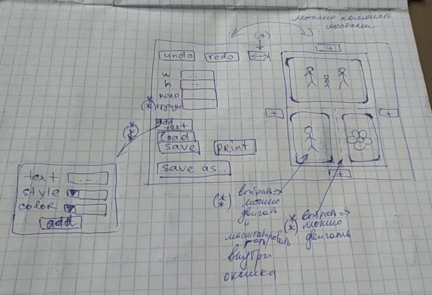

# Simple Collage Creating
# Table of Contents
1. [About application](#about-application)
2. [Requirements](#requirements)
3. [How to build](#how-to-build)
4. [Licence](#licence)

# About application

В приложении реализуется создание коллажей из фотографий. Предполагается возможность интерактивного добавления фотографий: добавить фотографию можно с любой из четырех сторон прямоугольника, при этом она займет половину изображения, а остальная часть коллажа будет масштабирована автоматически. Базовыми функциями являются создание полотна произвольного размера, заданного пользователем в пикселях, добавление фотографий, их автоматические масштабирование и обрезка, а также сохранение и печать получившегося коллажа. В качестве дополнительных функций возможно добавление параметров границ изображений (толщина, крутизна закругления уголка), реализация управления элементами на полотне: возможность передвинуть границы, изменить окно обрезки фотографии (масштабирование и изменение положения), а также добавление на полотно подписи. Ниже представлен макет UI:
 

# Requirements

- Python >= 3.7
- pip >= 19.0.3

# How to build
Clone repository and in collage root directory execute:
 - python3 -m pip install setuptools==46.0.0 wheel==0.34.2
 - python3 setup.py sdist bdist_wheel
 - pip3 install dist/collage-0.0.1-py3-none-any.whl

# Licence

**MIT**
